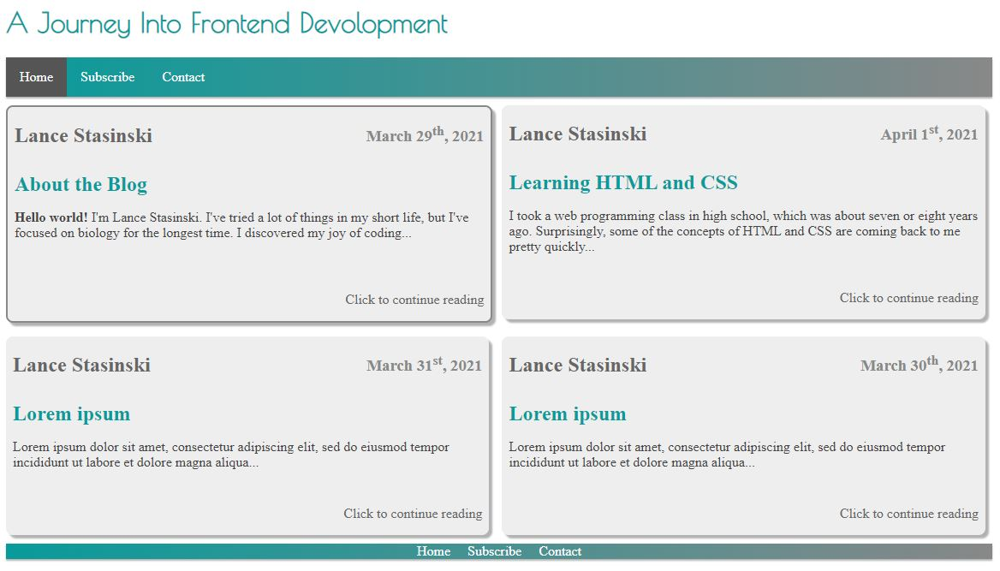

# Project1-blog

Small static blog website built with HTLM and CSS for project one of [Udacity's](https://www.udacity.com/course/front-end-web-developer-nanodegree--nd0011) FEND course.

## Table of Contents

- [Introduction](#Introduction)
- [Links](#Links)
- [Screenshot](#Screenshot)
- [Highlights](#Highlights)
- [Challenges](#Alternatives)
- [Ideas](#Ideas)
- [Acknowledgements](#Acknowledgements)

## Introduction

This was my first project built using HTML and CSS. It's a blog website with four blog posts and non-functional subscribe and contact pages. Although it is was very simple looking back at it, it was a great way to learn about the structure of an HTML document and about how to work with CSS and create responsive pages.

## Links

- Github - [https://github.com/LanceStasinski/FEND-01-BlogPost](https://github.com/LanceStasinski/FEND-01-BlogPost)
- Deployed - [https://lancestasinski.herokuapp.com/my-first-blog](https://lancestasinski.herokuapp.com/my-first-blog)

## Screenshot

## Highlights

- Seven HTML pages linked together
- Response UI built with CSS3 using Grid, Flexbox, and media queries
- Semantic HTML used to structure the webpages and improve accessibility

## Challenges

The most challenging aspect was getting the page layout right. I solved this issue by using Grid and Flexbox.

## Ideas

This blog could be improved by adding a form to dynamically create blog posts instead hard coding each post. However, this project was meant to practice HTML and CSS, so including JavaScript to add such functionality was beyond the scope of this project.

## Acknowledgements

[Udacity's](https://www.udacity.com/course/front-end-web-developer-nanodegree--nd0011) front end nanodegree program for this assignment and for providing feedback
